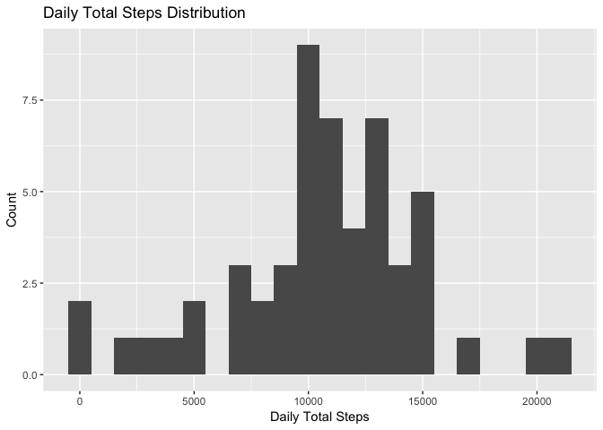
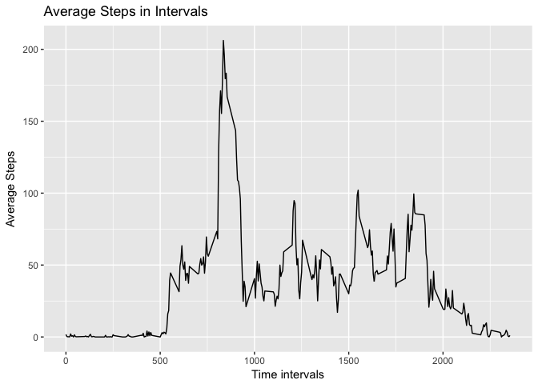
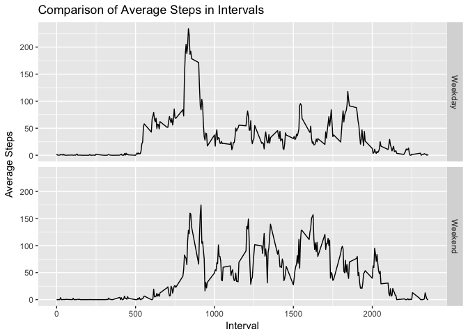

```r
library(ggplot2)
library(dplyr)
```

```
## 
## Attaching package: 'dplyr'
```

```
## The following objects are masked from 'package:stats':
## 
##     filter, lag
```

```
## The following objects are masked from 'package:base':
## 
##     intersect, setdiff, setequal, union
```

## Loading and preprocessing the data


```r
download.file('https://d396qusza40orc.cloudfront.net/repdata%2Fdata%2Factivity.zip','data.zip')

if(!file.exists('activity.csv')){
  unzip('data.zip')
}

df1 <- read.csv('activity.csv')
```


## What is mean total number of steps taken per day?

### 2.1 Calculate daily total steps

```r
df2 <- df1 %>%
  na.omit() %>%
  group_by(date) %>%
  summarise(steps = sum(steps))
```


### 2.2 Make histogram of daily total steps

```r
ggplot(data = df2, aes(x = steps)) + geom_histogram(binwidth = 1000) + xlab('Daily Total Steps') + ylab('Count') + ggtitle('Daily Total Steps Distribution')
```

<!-- -->

### 2.3 calculate mean and median

```r
mean(df2$steps)
```

```
## [1] 10766.19
```

```r
median(df2$steps)
```

```
## [1] 10765
```


## What is the average daily activity pattern?

### 3.1 Time series plot

```r
avgSteps <- df1 %>%
  na.omit() %>%
  group_by(interval) %>%
  summarise(steps = mean(steps))

ggplot(data =  avgSteps, aes(x=interval, y=steps)) + geom_line() +
  xlab('Time intervals') +
  ylab('Average Steps') +
  ggtitle('Average Steps in Intervals')
```

<!-- -->

### 3.2 Max number of steps

```r
avgSteps[which(avgSteps$steps == max(avgSteps$steps)),]
```

```
## # A tibble: 1 x 2
##   interval steps
##      <int> <dbl>
## 1      835  206.
```


## Imputing missing values

### 4.1 Total missing values

```r
sum(is.na(df1))
```

```
## [1] 2304
```

### 4.2 & 4.3 Fill in missing values and create a new data set

```r
replace_wiz_mean <- function(x){
  replace(x, is.na(x), mean(x, na.rm = TRUE))
}

df_new <- df1 %>%
  group_by(date) %>%
  mutate(steps = replace_wiz_mean(steps))
```

### 4.4 Make histogram of new dataset and compare mean & median

```r
df_new_1 <- df_new %>%
  group_by(date) %>%
  summarise(steps = sum(steps))

ggplot(data = df_new_1, aes(x = steps)) + geom_histogram(binwidth = 1000) + xlab('Daily Total Steps') + ylab('Count') + ggtitle('Daily Total Steps Distribution')
```

```
## Warning: Removed 8 rows containing non-finite values (stat_bin).
```

<!-- -->

```r
#print mean and median of daily total steps in new dataset
mean(na.omit(df_new_1$steps))
```

```
## [1] 10766.19
```

```r
median(na.omit(df_new_1$steps))
```

```
## [1] 10765
```

#### 4.4 Conclusion: The histogram and mean/median results are the same before/after replacing NA values.

## Are there differences in activity patterns between weekdays and weekends?

### 5.1 New factor variable

```r
df_new$DayIdentifier <- ifelse(weekdays(as.Date(df_new$date, format = "%Y-%m-%d")) %in% c("Monday", "Tuesday", "Wednesday", "Thursday", "Friday"), "Weekday", "Weekend") 
```

### 5.2

```r
df_new_2 <- df_new %>%
          na.omit() %>%
          group_by(interval, DayIdentifier) %>%
          summarise(steps = mean(steps))

p <- ggplot(df_new_2, aes(x = interval, y = steps)) + geom_line()
p + facet_grid(DayIdentifier ~.) + xlab('Interval') + ylab('Average Steps') + ggtitle('Comparison of Average Steps in Intervals')
```

<!-- -->

### Conclusion: There are differences in weekdays and weekends. Activity tends to start later in weekends. 
